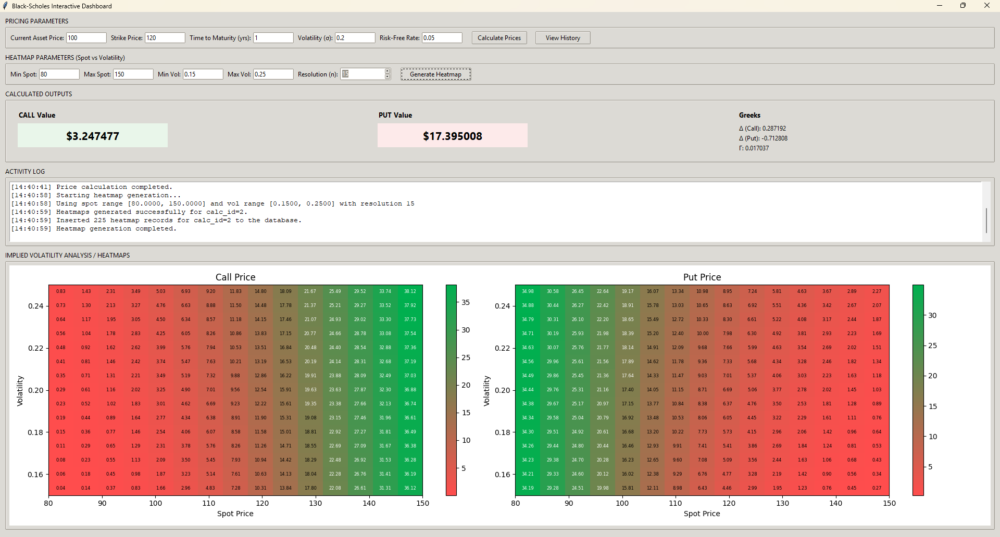

<!--
  OPBSX - README
  Enterprise-style README for a production-ready Black-Scholes option pricing application
-->

# OPBSX 🌐 — Option Pricing Black‑Scholes Explorer

A full-stack extensible tool for pricing, analyzing, and visualizing European options using the Black–Scholes model.

---

## Overview

OPBSX is a modular Python application designed for quantitative analysts, traders, and engineering teams who require a reliable and auditable platform to price European options, compute sensitivities (also known as Greeks), and explore parameter sensitivities through interactive visualizations. The project strikes a balance between numerical correctness, performance, and operational readiness, making it suitable for research environments, desktop analytics workflows, and as a component within larger analytics pipelines.





## Key Features

- Accurate Black–Scholes implementations: call/put prices and Greeks (Delta, Gamma), implemented with NumPy/SciPy and structured for unit testing.
- Interactive GUI dashboard: Tkinter + Matplotlib integration for live parameter entry, plotting, and heatmap exploration.
- Batch & programmatic API: core computational modules are decoupled from the UI so they can be reused from scripts or services.
- Persistent history: MySQL-backed storage for inputs/results to support audit trails and reproducible experiments.
- Extensible plotting: modular plotting utilities allow additional visualizations (implied vol surfaces, payoff diagrams) to be plugged in.
- Production-aware: environment-driven configuration, dependency pinning via `requirements.txt`, and clear separation between computation, persistence, and UI layers.
- Observability & diagnostics: structured logging and error handling hooks to integrate with monitoring/alerting.

## Tech Stack

- Python 🐍 — core language
- NumPy — numerical primitives
- SciPy — distributions and statistics
- Matplotlib — plotting and heatmaps
- Tkinter — cross-platform desktop UI
- MySQL — persistent storage (mysql-connector-python)
- python-dotenv — environment configuration

Optional infra (recommended for production): Docker 🐳, CI (GitHub Actions), code quality (flake8, mypy), dependency scanning (Dependabot).

## Repository Structure

```
OPBSX/
├── main.py                 # GUI entrypoint (Tkinter bootstrap)
├── requirements.txt        # pinned runtime dependencies
├── config/
│   └── settings.py         # DB and runtime configuration
├── core/
│   ├── calculations.py     # Option pricing orchestration
│   ├── db_setup.py         # Create/validate DB schema
│   ├── history.py          # Retrieve/store calculation history
│   └── plotting.py         # Plotting helpers and heatmaps
├── ui/
│   └── app.py              # Tkinter application UI and wiring
├── utils/
│   ├── black_scholes.py    # Numerical implementation (d1,d2,prices,greeks)
│   └── db.py               # DB handler abstraction
└── README.md               # This file
```

## Installation / Setup

These instructions assume a Windows development machine (PowerShell), Python 3.9+ installed, and access to a local or remote MySQL instance.

1. Clone the repository

```powershell
git clone https://github.com/KanavChopra/OPBSX.git
cd OPBSX
```

2. Create and activate a virtual environment

```powershell
python -m venv .venv
# PowerShell activation
.\.venv\Scripts\Activate.ps1
```

3. Install dependencies

```powershell
python -m pip install --upgrade pip
pip install -r requirements.txt
```

4. Configure environment

Create a `.env` file at the project root (see `Configuration` below for details) or set environment variables in your host/CI.

5. Initialize database schema (optional, requires MySQL reachable with configured credentials)

```powershell
python -c "from core.db_setup import create_table_if_not_exists; create_table_if_not_exists()"
```

## Usage / Running the App

Start the interactive GUI:

```powershell
python main.py
```

The GUI provides fields to enter Spot, Strike, Time-to-Maturity, Volatility, and Risk‑Free Rate and will compute call/put prices and selected Greeks. Use the plotting controls to generate heatmaps.

Programmatic usage (module import):

```python
from utils.black_scholes import BlackScholes

model = BlackScholes(time_to_maturity=0.5, strike=100, current_price=100, volatility=0.2, interest_rate=0.01)
results = model.run()  # returns dict with prices and Greeks
```

## Configuration

Use a `.env` file or environment variables. Example `.env` (do not commit secrets):

```
# Database
DB_HOST=127.0.0.1
DB_USER=username
DB_PASSWORD=password
DB_NAME=database_name
```

Key configuration notes:
- DB credentials: ensure the MySQL user has only the required privileges (INSERT/SELECT/CREATE on the specific DB).

## Contributing

We welcome contributions. Please follow these conventions:

- Branching: use `main` as protected default. Create feature branches: `feat/<short-desc>` or `fix/<short-desc>`.
- Pull requests: open PRs against `main`. Use clear titles, link issues, and include a short description of changes and test coverage.
- Commits: follow a conventional commit style (e.g., `feat: add heatmap export`), keep commits atomic.
- Review: at least one approving review required before merge. Resolve linting and test failures before merging.

Suggested PR checklist:
- [ ] Tests added/updated
- [ ] Linting passed
- [ ] Documentation updated (README/docs)
- [ ] No sensitive data in the diff

## Author

kanavchopra2002@gmail.com

## License

This repository is provided under the MIT License — see `LICENSE` for details.
